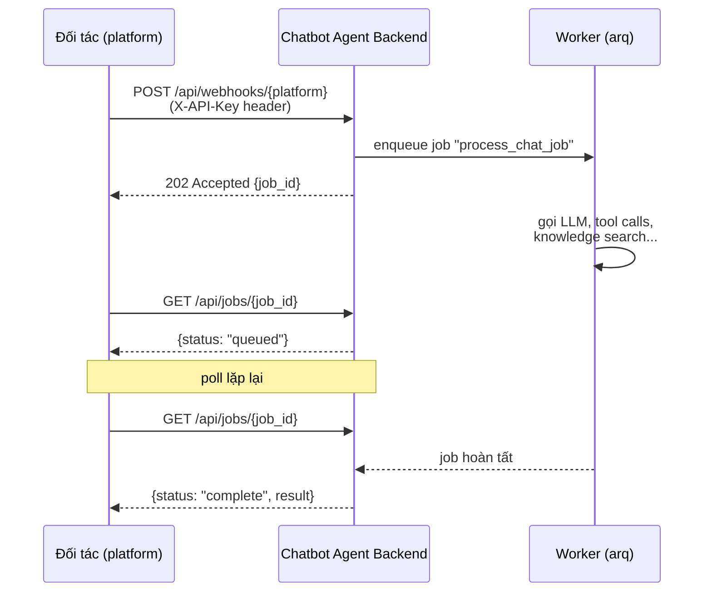
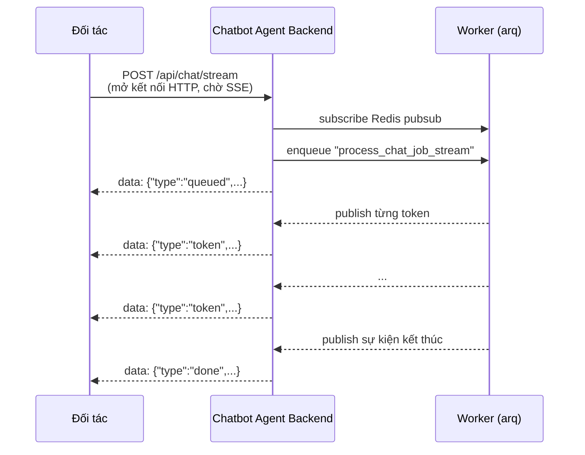

# Tài liệu tích hợp API Chatbot Agent (dành cho đối tác bên thứ ba)

Tài liệu này dành cho đội kỹ thuật của các nền tảng bên ngoài (chat client riêng, bot Telegram, hệ thống nội bộ, v.v.) muốn tích hợp với API chat của nền tảng chatbot agent này. Mọi endpoint, schema, và hành vi mô tả dưới đây được xác nhận trực tiếp từ mã nguồn backend (FastAPI, Python 3.12) tại thời điểm viết tài liệu.

> Toàn bộ code sample giữ nguyên tiếng Anh (endpoint, field name, JSON...) theo quy ước kỹ thuật thông thường; phần diễn giải bằng tiếng Việt.

---

## 1. Tổng quan luồng tích hợp

Nền tảng hoạt động theo mô hình **webhook + hàng đợi job bất đồng bộ (arq/Redis)**, có 2 cách nhận kết quả: **polling** (GET job status) hoặc **streaming** (SSE).

### 1.1 Luồng polling (webhook cổ điển)



### 1.2 Luồng streaming (SSE)



Cả hai luồng dùng chung: xác thực `X-API-Key`, rate limit, cơ chế `agent_id`/`session_id`, và tùy chọn `history` (server-managed vs client-managed — xem mục 4).

**Điểm quan trọng**: request không mang `domain_id`. Agent (`agent_id`) đã được cấu hình sẵn qua admin UI với domain (knowledge base) được gán trước — đối tác chỉ cần biết `agent_id` để gửi tin nhắn tới đúng agent.

---

## 2. Xác thực

Mọi endpoint công khai (webhook, chat/stream, jobs, conversations) yêu cầu header:

```
X-API-Key: cba_xxxxxxxxxxxxxxxxxxxxxxxxxxxxxxxx
```

- Định dạng key: `cba_` + 32 ký tự hex.
- Key được **admin của nền tảng** tạo qua endpoint quản trị `POST /api/api-keys` (bảo vệ bởi HTTP Basic Auth — admin username/password, không dành cho đối tác gọi trực tiếp). Giá trị raw key **chỉ được trả về một lần** tại thời điểm tạo — chỉ SHA-256 hash được lưu trong DB, nên nếu mất key phải tạo lại (revoke key cũ qua `POST /api/api-keys/{id}/revoke`).
- Đối tác **không tự tạo được key** — phải liên hệ đội vận hành/admin của nền tảng để được cấp `agent_id` (agent nào sẽ trả lời) và một API key riêng.
- Thiếu header `X-API-Key` → `401 Unauthorized` (`{"detail": "Missing API key"}`).
- Key sai hoặc đã bị revoke → `401 Unauthorized` (`{"detail": "Invalid or revoked API key"}`).
- Mỗi API key có thể có `rate_limit_per_minute` riêng (do admin cấu hình khi tạo key); nếu không set, dùng mặc định toàn hệ thống.

---

## 3. Chi tiết endpoint

### 3.1 `POST /api/webhooks/{platform}` — gửi tin nhắn (nhận job bất đồng bộ)

**Headers**
```
X-API-Key: <api key>
Content-Type: application/json
```

**Path param**: `platform` — slug định danh adapter xử lý payload (ví dụ `generic`). Nếu chưa đăng ký adapter cho platform này ở backend → `404 Unknown platform`.

**Request body** (theo `GenericAdapter`, adapter mặc định/tham chiếu):

| Field | Type | Bắt buộc | Ghi chú |
|---|---|---|---|
| `agent_id` | string (UUID) | Có | ID agent đã cấu hình qua admin UI |
| `message` | string | Có | Nội dung tin nhắn người dùng |
| `session_id` | string | Không | Nếu bỏ qua, backend tự sinh UUID mới (đối tác nên tự quản lý để giữ liên tục hội thoại) |
| `metadata` | object | Không | Dữ liệu tuỳ ý, đi kèm qua job và log |
| `history` | array of `{role, content}` | Không | Xem mục 4 — có = client-managed history |

```json
{
  "agent_id": "6f1b0e2a-2222-4b8e-9d2c-111122223333",
  "session_id": "user-42-session-1",
  "message": "Sản phẩm A có bảo hành bao lâu?",
  "metadata": {"channel": "web-widget"}
}
```

**Response — `202 Accepted`**
```json
{ "job_id": "b7e4c1a2f3d94e1a8b2c6d5e7f809c11" }
```

**Ví dụ curl**
```bash
curl -X POST https://<host>/api/webhooks/generic \
  -H "X-API-Key: cba_xxxxxxxxxxxxxxxxxxxxxxxxxxxxxxxx" \
  -H "Content-Type: application/json" \
  -d '{"agent_id":"6f1b0e2a-...","message":"Xin chào"}'
```

**Mã lỗi**
- `401` — thiếu/sai API key.
- `404` — `platform` không được đăng ký, hoặc `agent_id` không tồn tại/không active (`{"detail": "Agent not found"}` — cố ý trả cùng thông điệp cho cả UUID sai định dạng lẫn agent không tồn tại, để không lộ thông tin).
- `422` — payload không hợp lệ theo adapter (thiếu `agent_id`/`message`, `metadata` không phải object, `history` sai định dạng hoặc vượt giới hạn) — `{"detail": "<mô tả lỗi>"}` (chuỗi, không phải mảng lỗi Pydantic chuẩn).
- `429` — vượt rate limit (xem mục 7), kèm header `Retry-After`.

> **Lưu ý cho adapter khác `generic`**: mỗi platform có thể có adapter riêng với payload khác — mục này mô tả contract của adapter `generic`, dùng làm tham chiếu mặc định. Nếu đối tác cần một payload đặc thù (ví dụ đúng format webhook của Zalo/Telegram), cần đội core viết adapter riêng (xem mục 5).

### 3.2 `GET /api/jobs/{job_id}` — kiểm tra trạng thái job

**Headers**: `X-API-Key: <api key>`

**Response schema**
```json
{
  "job_id": "string",
  "status": "queued | in_progress | complete | failed | not_found",
  "result": { } // object hoặc null tuỳ status
}
```

- Khi `status = "complete"`: `result` = `{"reply": "...", "session_id": "...", "iterations": <int>, "stopped_on": "<string>", "citations": [...]}`.
- Khi `status = "failed"`: `result` = `{"error": "<thông điệp lỗi>"}`.
- Khi `status` là `queued`/`in_progress`: `result = null`.
- Job không tồn tại (đã hết hạn khỏi Redis hoặc `job_id` sai) → HTTP `404 Not Found`, `{"detail": "Job not found"}` (không phải `status: "not_found"` trong body — router chặn trước và raise 404).

**Ví dụ `result` khi hoàn tất, có trích dẫn**
```json
{
  "reply": "Chính sách đổi trả cho phép hoàn tiền trong 30 ngày [1].",
  "session_id": "user-42-session-1",
  "iterations": 2,
  "stopped_on": "final_answer",
  "citations": [
    {
      "marker": 1,
      "source_id": "3f9a1c2e-...",
      "title": "chinh-sach-doi-tra.pdf",
      "snippet": "Khách hàng có thể yêu cầu hoàn tiền trong vòng 30 ngày kể từ ngày mua...",
      "score": 0.812,
      "metadata": {}
    }
  ]
}
```
Xem mục 3.6 để biết chi tiết cấu trúc `Citation`.

**Ví dụ curl**
```bash
curl https://<host>/api/jobs/b7e4c1a2f3d94e1a8b2c6d5e7f809c11 \
  -H "X-API-Key: cba_xxxxxxxxxxxxxxxxxxxxxxxxxxxxxxxx"
```

Đối tác nên poll với khoảng nghỉ hợp lý (ví dụ 1–2 giây/lần, backoff nếu chờ lâu) — hiện không có endpoint webhook đẩy ngược kết quả (xem mục 3.5 về `send_response`).

### 3.3 `POST /api/chat/stream` — chat qua Server-Sent Events (SSE)

Thay thế polling khi cần hiển thị phản hồi theo thời gian thực (token-by-token).

**Headers**
```
X-API-Key: <api key>
Content-Type: application/json
```

**Request body** (`ChatStreamRequest`):

| Field | Type | Bắt buộc | Ghi chú |
|---|---|---|---|
| `agent_id` | string | Có | |
| `message` | string | Có | |
| `session_id` | string \| null | Không | Tự sinh UUID nếu bỏ qua |
| `metadata` | object | Không | |
| `history` | array of `{role, content}` \| null | Không | Cùng contract client-managed như webhook, giới hạn `MAX_CLIENT_HISTORY_MESSAGES` (mặc định 200) |

```json
{
  "agent_id": "6f1b0e2a-2222-4b8e-9d2c-111122223333",
  "session_id": "user-42-session-1",
  "message": "Tóm tắt chính sách đổi trả"
}
```

**Response**: `200 OK`, `Content-Type: text/event-stream`, mỗi sự kiện là một dòng `data: <json>\n\n`. Các loại `type` quan sát được trong worker:

| `type` | Khi nào | Payload thêm |
|---|---|---|
| `queued` | Ngay khi backend nhận request, trước khi worker chạy | `job_id` |
| `thinking` | Nếu model phát ra nội dung "suy nghĩ" (tuỳ provider) | `delta` |
| `token` | Mỗi phần văn bản trả lời được sinh ra | `delta` |
| `done` | Kết thúc thành công | `reply`, `session_id`, `iterations`, `stopped_on`, `citations` |
| `error` | Có lỗi trong lúc xử lý | `message` |

Stream dừng lại sau khi nhận `done` hoặc `error` (đây là các message "terminal" — server tự đóng kết nối).

**Ví dụ curl**
```bash
curl -N -X POST https://<host>/api/chat/stream \
  -H "X-API-Key: cba_xxxxxxxxxxxxxxxxxxxxxxxxxxxxxxxx" \
  -H "Content-Type: application/json" \
  -d '{"agent_id":"6f1b0e2a-...","message":"Xin chào"}'
```

**Mã lỗi**: giống webhook (`401`, `404` agent không tồn tại, `429` rate limit). Vì body được validate trực tiếp bởi Pydantic (`ChatStreamRequest`), lỗi định dạng (thiếu field, sai kiểu, `history` vượt `MAX_CLIENT_HISTORY_MESSAGES`) trả `422` theo **format chuẩn của FastAPI** (`{"detail": [{"loc": [...], "msg": "...", "type": "..."}]}`) — khác với format chuỗi đơn của webhook (mục 3.1), vì webhook dùng `ChannelAdapter.parse_incoming` tự raise lỗi dạng chuỗi còn endpoint này để FastAPI validate trực tiếp trên request body.

### 3.4 `GET /api/conversations/{agent_id}/{session_id}/messages` — đọc lịch sử hội thoại

Cho phép client tự hiển thị lại các lượt hội thoại trước đó mà không cần biết chi tiết cấu hình agent.

**Headers**: `X-API-Key: <api key>`

**Query param**: `limit` (int, tuỳ chọn, `1..200`). Nếu bỏ qua, dùng `Settings.CHAT_HISTORY_LIMIT` (mặc định 20), luôn bị chặn trần ở 200 dù truyền `limit` lớn hơn.

**Response**
```json
{
  "messages": [
    {"role": "user", "content": "Xin chào", "created_at": "2026-08-11T10:00:00Z", "citations": null},
    {"role": "assistant", "content": "Chào bạn, tôi có thể giúp gì?", "created_at": "2026-08-11T10:00:02Z", "citations": null}
  ]
}
```

`role` chỉ nhận `user` hoặc `assistant`. `citations` (`Citation[] | null`) chỉ khác `null` trên tin nhắn `assistant` từng trích dẫn nguồn — tin nhắn `user` luôn có `citations: null`. Xem mục 3.6.

**Ví dụ curl**
```bash
curl "https://<host>/api/conversations/6f1b0e2a-.../user-42-session-1/messages?limit=50" \
  -H "X-API-Key: cba_xxxxxxxxxxxxxxxxxxxxxxxxxxxxxxxx"
```

**Quan trọng**: nếu session đó từng chạy ở chế độ **client-managed history** (đối tác tự gửi `history` trong mọi request), endpoint này sẽ **trả về rỗng** cho session đó — server không hề ghi gì vào `chat_messages` trong chế độ đó (xem mục 4).

**Mã lỗi**: `401` (auth), `404` nếu `agent_id` không tồn tại/không active — không có lỗi riêng cho `session_id` không tồn tại (trả `messages: []`).

### 3.5 Về "đẩy" phản hồi ngược lại (push)

`ChannelAdapter.send_response()` hiện là **no-op** cho mọi adapter đã có trong repo (kể cả `generic`) — kênh nhận kết quả duy nhất hiện nay là polling `GET /api/jobs/{job_id}` hoặc SSE (`/api/chat/stream`). Nếu đối tác cần backend chủ động gọi ngược webhook của họ khi có kết quả, đây là điểm mở rộng (`send_response`) nhưng **chưa được triển khai cho bất kỳ platform nào** — cần xác nhận với đội core nếu có nhu cầu này.

### 3.6 Đối tượng `Citation` (trích dẫn nguồn)

Khi agent bật `enable_knowledge_search` và trả lời có trích dẫn nguồn bằng ký hiệu `[n]` ngay trong văn bản trả lời, các nguồn được trích dẫn sẽ đi kèm dưới dạng mảng `citations` — xuất hiện ở cả ba nơi: `result.citations` (mục 3.2), sự kiện `done` của SSE (mục 3.3), và trường `citations` trên tin nhắn `assistant` khi đọc lại lịch sử hội thoại (mục 3.4).

| Field | Type | Ghi chú |
|---|---|---|
| `marker` | int | Số `n` tương ứng với ký hiệu `[n]` mà agent chèn trong văn bản trả lời |
| `source_id` | string | ID của chunk/tài liệu nguồn |
| `title` | string | Tên file tài liệu nguồn |
| `snippet` | string | Tối đa 300 ký tự trích từ nội dung chunk |
| `score` | number \| null | Điểm liên quan (cosine similarity) từ knowledge search, có thể `null` |
| `metadata` | object | Metadata tuỳ theo tài liệu/chunk |

**Lưu ý quan trọng**:
- Mảng `citations` chỉ chứa những nguồn mà agent **thực sự trích dẫn** qua `[n]` trong câu trả lời — không phải toàn bộ kết quả `knowledge_search` đã truy vấn. Thứ tự trong mảng là thứ tự xuất hiện lần đầu của `[n]` trong văn bản.
- Có thể là mảng rỗng `[]` (agent không trích dẫn nguồn nào, kể cả khi có gọi `knowledge_search`).
- Ký hiệu `[n]` được giữ nguyên trong văn bản trả lời (`reply`/`content`) — đối tác tự render liên kết giữa `[n]` và phần tử tương ứng trong `citations` nếu cần.

---

## 4. Quản lý lịch sử hội thoại: server-managed vs client-managed

Cơ chế này áp dụng **giống nhau** cho cả webhook (3.1) và chat/stream (3.3), qua field `history` trong request body.

### 4.1 Server-managed (mặc định — khi **không gửi** field `history`)

- Backend tự load các lượt hội thoại trước đó từ bảng `chat_messages`, khoá theo `(agent_id, session_id)` — **không** theo `domain_id`.
- Sau khi có phản hồi, backend tự ghi (`append_turn`) cả tin nhắn user + trả lời assistant vào `chat_messages`.
- Số lượt tải lại mỗi lần: `Settings.CHAT_HISTORY_LIMIT` (mặc định 20).
- Đây là cách đơn giản nhất cho đối tác không muốn tự quản lý state hội thoại.
- **Lưu ý cách kích hoạt**: sự **vắng mặt** của field `history` trong JSON (không phải mảng rỗng `[]`) là tín hiệu server-managed. Nếu gửi `"history": []`, hệ thống coi đó là **client-managed với 0 lượt trước đó** — không load lịch sử cũ và cũng không ghi gì vào DB.

### 4.2 Client-managed (khi **có gửi** field `history`, kể cả mảng rỗng)

- Đối tác tự giữ toàn bộ lịch sử hội thoại phía mình và gửi kèm mỗi request dưới dạng:
```json
"history": [
  {"role": "user", "content": "Câu hỏi trước"},
  {"role": "assistant", "content": "Câu trả lời trước"}
]
```
- `role` chỉ chấp nhận `user` hoặc `assistant` (không cho phép `system`/`tool` — tránh client chèn prompt giả trước system prompt thật của agent).
- Giới hạn: tối đa `Settings.MAX_CLIENT_HISTORY_MESSAGES` phần tử (mặc định **200**). Vượt quá → `422` (webhook: string detail; chat/stream: Pydantic validation error).
- Backend **dùng nguyên `history` gửi lên**, không load từ DB, và **không ghi** turn mới vào `chat_messages` — nghĩa là `GET /api/conversations/.../messages` sẽ luôn trả rỗng cho các session dùng chế độ này.
- Phù hợp khi đối tác đã có hệ thống lưu trữ hội thoại riêng (ví dụ CRM/app của họ) và muốn toàn quyền kiểm soát ngữ cảnh gửi cho LLM (cắt bớt, tóm tắt, chèn thêm ngữ cảnh riêng...).

### 4.3 Khi nào chọn cái nào

| Tiêu chí | Server-managed | Client-managed |
|---|---|---|
| Đối tác không có hạ tầng lưu hội thoại | ✅ | |
| Cần tự kiểm soát/tối ưu ngữ cảnh gửi LLM (tóm tắt, cắt bớt) | | ✅ |
| Cần đọc lại lịch sử qua API `GET /api/conversations/...` | ✅ | ❌ (luôn rỗng) |
| Đổi cách dùng giữa 2 chế độ cho cùng 1 session | Có thể trộn tuỳ theo request, nhưng dữ liệu sẽ không nhất quán (một phần lưu DB, một phần không) — nên chọn 1 chế độ cố định cho mỗi session | |

---

## 5. Viết một `ChannelAdapter` mới (nếu muốn tự đóng gói platform riêng)

Nếu payload webhook chuẩn của nền tảng đối tác (Zalo, Telegram, Messenger, hệ thống nội bộ riêng...) khác với format `generic` ở mục 3.1, backend hỗ trợ điểm mở rộng `ChannelAdapter` (`app/channels/base.py`):

- Mỗi adapter implement `platform` (slug định danh trong URL `/api/webhooks/{platform}`) và `parse_incoming(payload, headers) -> IncomingMessage` (map payload gốc → `agent_id`, `session_id`, `text`, `metadata`, `history` tuỳ chọn).
- Adapter được đăng ký thủ công vào `ChannelRegistry` (`app/channels/registry.py`) — **đây là thay đổi trong mã nguồn backend**, không phải cấu hình runtime qua admin UI.
- **Đối tác không tự đăng ký được adapter mới** — đây là việc của đội core (backend team) của nền tảng. Đối tác cần cung cấp: mẫu payload webhook thực tế của platform họ, cách platform đó xác định user/session, và (nếu cần) cách gửi phản hồi ngược (`send_response`, hiện là no-op mặc định — xem 3.5).
- Sau khi có adapter riêng, mọi hành vi khác (auth, rate limit, job queue, history, streaming) giữ nguyên như mục 1–4 — chỉ khác ở format payload đầu vào `POST /api/webhooks/{platform_moi}`.

---

## 6. Xử lý lỗi và mã lỗi phổ biến

| HTTP Status | Khi nào | Body ví dụ |
|---|---|---|
| `401 Unauthorized` | Thiếu `X-API-Key` | `{"detail": "Missing API key"}` |
| `401 Unauthorized` | Key sai/đã revoke | `{"detail": "Invalid or revoked API key"}` |
| `404 Not Found` | `platform` chưa đăng ký (webhook) | `{"detail": "Unknown platform"}` |
| `404 Not Found` | `agent_id` không tồn tại, không active, hoặc UUID sai định dạng | `{"detail": "Agent not found"}` |
| `404 Not Found` | `job_id` không tồn tại/đã hết hạn khỏi Redis | `{"detail": "Job not found"}` |
| `422 Unprocessable Entity` | Payload webhook thiếu field bắt buộc, sai kiểu, hoặc `history` vượt giới hạn | `{"detail": "Missing or invalid 'agent_id'"}` (chuỗi, endpoint webhook) |
| `422 Unprocessable Entity` | Body `POST /api/chat/stream` sai schema Pydantic | `{"detail": [{"loc": [...], "msg": "...", "type": "..."}]}` (mảng lỗi chuẩn FastAPI) |
| `429 Too Many Requests` | Vượt rate limit theo key hoặc theo session | `{"detail": "Rate limit exceeded for this API key"}` hoặc `"...for this session"`, kèm header `Retry-After: <giây>` |
| `5xx` | Lỗi nội bộ (LLM provider lỗi, DB lỗi...) khi enqueue job | Không có schema cố định — cần retry hợp lý phía client; kết quả job thất bại giữa chừng (sau khi job đã enqueue) thể hiện qua `GET /api/jobs/{job_id}` trả `status: "failed"`, `result: {"error": "..."}` chứ không phải HTTP lỗi, vì lúc đó request webhook đã trả `202` từ trước |

**Gợi ý xử lý phía đối tác**: với `429`, tôn trọng header `Retry-After` trước khi gửi lại. Với `422`, đây là lỗi client (dữ liệu sai) — không nên retry nguyên trạng.

---

## 7. Rate limit, timeout và các giới hạn thực tế

Các giá trị dưới đây là **mặc định trong code** (`app/core/config.py`) — có thể được đội vận hành đổi qua biến môi trường `.env`, nên **xác nhận giá trị thực tế đang chạy với đội core** trước khi tích hợp production.

| Giới hạn | Giá trị mặc định | Ghi chú |
|---|---|---|
| Rate limit theo API key | 60 request/phút (`RATE_LIMIT_PER_MINUTE`) | Có thể bị ghi đè theo từng key qua `rate_limit_per_minute` khi admin tạo key |
| Rate limit theo session (trong 1 key) | 20 request/phút (`RATE_LIMIT_SESSION_PER_MINUTE`) | Áp dụng cho `webhook` và `chat/stream`, khoá theo `(api_key.id, session_id)` |
| Cửa sổ rate limit | Fixed window 60 giây (không phải sliding window) | Bắt đầu tính từ request đầu tiên trong cửa sổ |
| Số lượt hội thoại tải mặc định (server-managed) | 20 (`CHAT_HISTORY_LIMIT`) | |
| Trần `limit` khi gọi `GET /api/conversations/.../messages` | 200 (cứng trong router, không đổi qua config) | |
| Số phần tử tối đa trong `history` (client-managed) | 200 (`MAX_CLIENT_HISTORY_MESSAGES`) | Vượt quá → `422` |
| Độ dài tối đa của `message`/`text` | **Không giới hạn rõ ràng trong code đã đọc** | Cần xác nhận với đội core — có thể bị giới hạn gián tiếp bởi context window của model LLM cấu hình cho agent |
| Timeout xử lý job (LLM, tool calls...) | **Không thấy timeout tường minh ở tầng webhook/job trong code đã đọc** (`AgentBuilder` giới hạn số vòng lặp tool-call ở 10, nhưng không phải timeout theo thời gian) | Cần xác nhận với đội core nếu cần SLA thời gian phản hồi cụ thể |
| Job hết hạn trong Redis (TTL kết quả) | **Không xác định được từ code đọc được** (phụ thuộc cấu hình arq mặc định) | Nếu poll quá muộn, `GET /api/jobs/{job_id}` có thể trả `404 Job not found` dù job từng chạy — nên poll trong thời gian hợp lý sau khi enqueue |

---

## 8. Checklist tích hợp nhanh

1. **Liên hệ đội vận hành nền tảng** để được cấp:
   - `agent_id` — agent (đã gắn domain/knowledge base, provider, system prompt phù hợp) cần dùng.
   - API key (`X-API-Key`, dạng `cba_...`) — lưu ý key chỉ hiển thị **một lần** lúc tạo, phải lưu trữ an toàn ngay.
   - Xác nhận `platform` slug cần dùng khi gọi webhook (`generic` nếu dùng adapter mặc định; nếu cần payload riêng, xem mục 5 và phối hợp với đội core trước).
2. **Quyết định chế độ lịch sử hội thoại** (mục 4): server-managed (đơn giản) hay client-managed (tự kiểm soát ngữ cảnh) — và giữ nhất quán cho mỗi `session_id`.
3. **Cài đặt `session_id`** ổn định cho mỗi cuộc hội thoại/người dùng phía đối tác (không để backend tự sinh UUID mới mỗi lần nếu cần giữ ngữ cảnh).
4. **Chọn cơ chế nhận kết quả**: polling (`GET /api/jobs/{job_id}`) đơn giản hơn để triển khai; SSE (`POST /api/chat/stream`) cho trải nghiệm streaming thời gian thực.
5. **Test thử với môi trường staging/dev**: gửi 1 request webhook mẫu, xác nhận nhận `202 {job_id}`, poll tới khi `status: "complete"`, kiểm tra `result.reply`.
6. **Xử lý lỗi**: implement retry có tôn trọng `Retry-After` cho `429`; log và không retry với `422`; xử lý `404 agent not found`/`Job not found` như lỗi cấu hình cần kiểm tra lại `agent_id`/thời gian poll.
7. **Nếu cần đọc lại lịch sử** qua `GET /api/conversations/{agent_id}/{session_id}/messages`, xác nhận đang ở chế độ server-managed (client-managed sẽ luôn trả rỗng).
8. **Xác nhận với đội core** các mục còn để ngỏ ở mục 7 (giới hạn độ dài message, timeout job, TTL kết quả trong Redis) trước khi go-live production, đặc biệt nếu có yêu cầu SLA cụ thể.
9. Nếu cần backend chủ động đẩy kết quả ngược (thay vì polling/SSE), trao đổi sớm với đội core — đây là điểm mở rộng (`send_response`) hiện chưa triển khai cho platform nào.

---

*Tài liệu được biên soạn dựa trên mã nguồn tại thời điểm 2026-08-11 (nhánh `develop`). Các phần đánh dấu "cần xác nhận với đội core" không thể xác minh chắc chắn từ code đã đọc — vui lòng xác nhận trực tiếp trước khi phụ thuộc vào hành vi đó trong production.*
